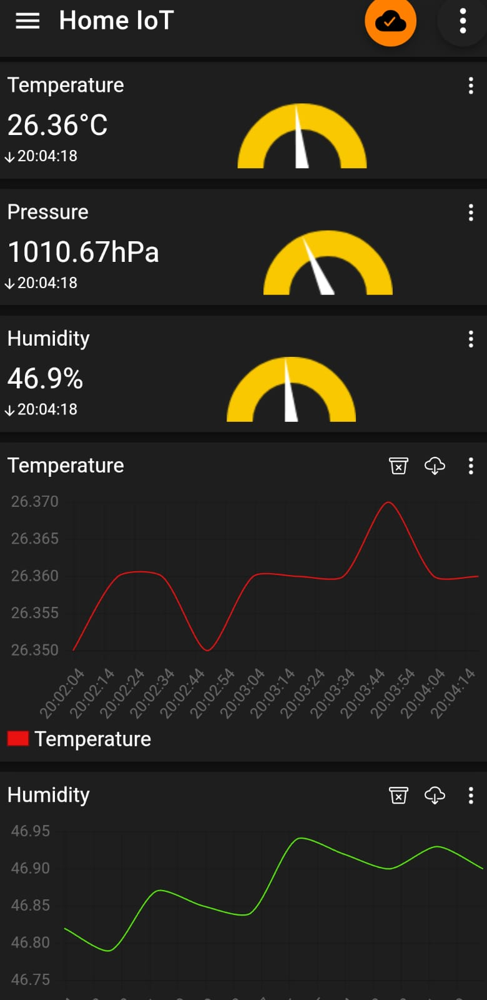

# Home IoT Project

This project reads data from a BME280 sensor connected to a Raspberry Pi and publishes it to an MQTT broker using MQTTv5. The data includes temperature, pressure, and humidity readings. All the services, including the MQTT broker, Node-RED, InfluxDB, and Grafana, are run using Docker and managed with a `docker-compose` file.

## Hardware requirements

- Raspberry Pi.
- BME280 Sensor.

## Technologies used


- **Mosquitto:** An open-source MQTT broker that facilitates the communication of data between the sensor and other services such as Node-RED, InfluxDB, and Grafana. Mosquitto is lightweight and supports various messaging protocols, making it ideal for IoT applications.

- **Node-RED:** A flow-based development tool for visual programming. It can subscribe to the MQTT topic and process the sensor data.

- **InfluxDB:** A time-series database where the sensor data can be stored for efficient querying and analysis.

- **Grafana:** A powerful visualization tool that can be used to create dashboards and visualize the data stored in InfluxDB.


## Folder Structure

```bash
Home_IoT_project/
│
├── _src/
│ └── images/
│
├── data/
│ └── mqtt/
│   └── config/
│     └── mosquitto.conf
│
├── sensor_publisher/
│ ├── BME280_sensor_client.py
│ ├── Dockerfile
│ └── requirements.txt
│
├── README.md
├── docker-compose.yml
└── LICENSE
```

## Installation

1. Clone the repository:

```bash
git clone https://github.com/engfuentes/Home_IoT_project.git
cd Home_IoT_project
```

## Usage

### Create a .env file

Create a *.env* file in the *Home_IoT_project/* folder choosing your desired values with the following:

    INFLUXDB_INIT_USERNAME = "<influx_username>"
    INFLUXDB_INIT_PASSWORD = "<influx_password>"
    INFLUXDB_INIT_ADMIN_TOKEN = "<influx_admin_token>"
    INFLUXDB_INIT_ORG = "<influx_org>"
    INFLUXDB_INIT_BUCKET = "<influx_bucket>"
    MOSQUITTO_USERNAME = "<mosquitto_username>"
    MOSQUITTO_PASSWORD = "<mosquitto_password>"

### Setup the Mosquitto server

1. Create Mosquitto password file - pwfile and fill it with your user and password:
    
```bash
cd data/mqtt/config
nano pwfile
```

Write inside your desired *mosquitto_username* and *mosquitto_password*. Save the file:

    <mosquitto_username>:<mosquitto_password>
  
2. Run the docker compose

```bash
sudo docker compose up -d --build
```
3. Enter to the Mosquitto shell

```bash
sudo docker exec -it mosquitto sh
```

4. Change to the config folder and run the following code to encrypt the password file:

```bash
cd mosquitto/config
mosquitto_passwd -U pwfile
```

7. To subscribe to a topic directly in Mosquitto:

```bash
mosquitto_sub -v -t '<topic>' -u <user> -P <password>
```

8. To publish to a topic directly in Mosquitto:

```bash
mosquitto_pub -t '<topic>' -m '<message>' -u <user> -P <password>
```

### Setup the Node-RED

1. Access to the Node-RED GUI in your browser:
   
   If using your Raspberry PI: http://localhost:1880/ <br>
   If using another laptop: http://raspberrypi.local:1880/

2. Add support for InfluxDB:

    Manage palette > Install > node-red-contrib-influxdb 

3. Add an *mqtt in node* and configure the node adding a server:

    *Connection*<br>
    **Name:** MQTT Home IoT Broker<br>
    **Server:** mosquitto <br>
    **Port:** 1883 <br>
    *Security*<br>
    **Username:** <mosquitto_username> <br>
    **Password:** <mosquitto_password> <br>

    *Properties*<br>
    **Topic:** sensor/bme280 <br>
    **Name:** Sensor-BME280

Deploy and add a Debug node to test if you get the messages

3. Add an *influxdb out node* and configure it adding a server:

    **Name:** Home InfluxDB<br>
    **Version:** 2.0 <br>
    **URL:** http://influxdb:8086 <br>
    **Token:** <influx_admin_token> <br>

    **Name:** InfluxDB-BME280<br>
    **Organization:** <influx_org> <br>
    **Bucket:** <influx_bucket> <br>
    **Measurement:** sensor/bme280

Connect the different nodes and click the *Deploy* button:


### Check results in InfluxDB

Now when you connect to InfluxDB you should see the data in the bucket that you named in the *.env* file:

   If using your Raspberry PI: http://localhost:8086/ <br>
   If using another laptop: http://raspberrypi.local:8086/


### Configure Grafana

Defaut login values:<br>

- **admin:** admin <br>
- **password:** admin

1. Add the data source:

    Choose the Influx DB:<br>

    **Query Language:** Flux <br>
    **URL:** http://influxdb:8086 <br>
    **User:** <influx_username> <br>
    **Password:** <influx_password> <br>
    **Organization:** <influx_org> <br>
    **Token:** <influx_admin_token> <br>
    **Default Bucket:** <influx_bucket> <br>

2. Create Dashboard and Add Visualization, Choose the InfluxDB.
3. Go back to the InfluxDB GUI in http://influxdb:8086 and enter to the bucket and make a query, for example for the temperature. Then go to *SCRIPT EDITOR* and copy the query.


5. Go back to Grafana and paste the query 


For more information about Flux queries: https://docs.influxdata.com/influxdb/v2/query-data/flux/

Then you can choose different graphs and options and make your dashboard:


### Mobile Phone App

If you want to have the data in your mobile phone you can download the app "IoT MQTT Panel" and create your dashboard.

